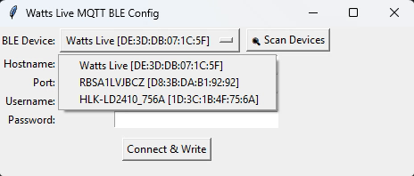
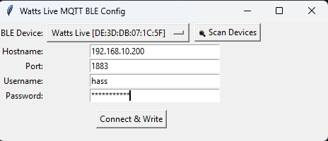
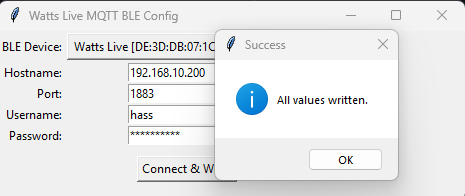

# 🔌 Watts Live MQTT BLE Config

A cross-platform tool to configure **Watts Live** IoT devices with **MQTT settings over Bluetooth Low Energy (BLE)**.

This utility is a **desktop GUI app** built with **Python**, **Tkinter**, and **Bleak**. It connects to a BLE-enabled Watts Live device, allows the user to enter MQTT credentials, and writes them to the appropriate GATT characteristics.

## ✨ Features

- 🔍 Scan for BLE devices (e.g., "Watts Live")
- 🔗 Select and connect to a device
- 📡 Write MQTT settings:
  - Hostname (UTF-8)
  - Port (uint16, Little Endian)
  - Username (UTF-8)
  - Password (UTF-8)
- 🖥️ Cross-platform GUI with Tkinter
- ✅ Validates user input before writing

## 🖥️ Desktop GUI Version (Python)

### Requirements

- Python 3.8 or newer
- BLE-compatible device (Bluetooth 4.0+)
- OS: Windows, macOS, or Linux

### Installation & Usage

```bash
# Clone the repository
git clone https://github.com/DonSidro/watts-live-mqtt-ble-config.git
cd watts-live-mqtt-ble-config

# Install dependencies
pip install bleak

# Run the GUI app
python watts_live_gui.py
```

## 🔐 BLE Permissions & Notes

### Windows/macOS

- Ensure **Bluetooth is enabled**
- On macOS, grant access in:  
  `System Settings > Privacy & Security > Bluetooth`

### Linux

- May require running the script with `sudo`
- BlueZ backend must be installed and active

## 🧠 Technical BLE Info

### Service UUID

```
a2e1ea9b-01e8-4fe5-9b99-35e9cb44d4b6
```

### Characteristic Map

| Field     | Characteristic UUID                             | Format                  |
|-----------|--------------------------------------------------|--------------------------|
| Hostname  | 8143af58-b9b8-47ca-911d-ad3564f10d0b             | UTF-8 string             |
| Port      | c0175553-1ffd-4eb5-99ca-dc271f4ca050             | uint16 (Little Endian)   |
| Username  | 41b6703a-0bac-46b4-a0fa-273f5bf641dc             | UTF-8 string             |
| Password  | a59394ed-b929-41a9-81ab-8a16eec6a28c             | UTF-8 string             |

## 📸 Screenshots

### BLE Device Scan


### MQTT Input Form


### Write Confirmation


## 📁 File Overview

```
watts-live-mqtt-ble-config/
├── watts_live_gui.py      # Python GUI app
├── README.md              # This file
├── requirements.txt       # Python dependencies
└── LICENSE
```

## 📄 License

This project is licensed under the [MIT License](LICENSE).

## 🙋‍♂️ Author & Credits

Created by [Sidon (DonSidro)].  
Powered by [Bleak](https://github.com/hbldh/bleak) and Tkinter.
