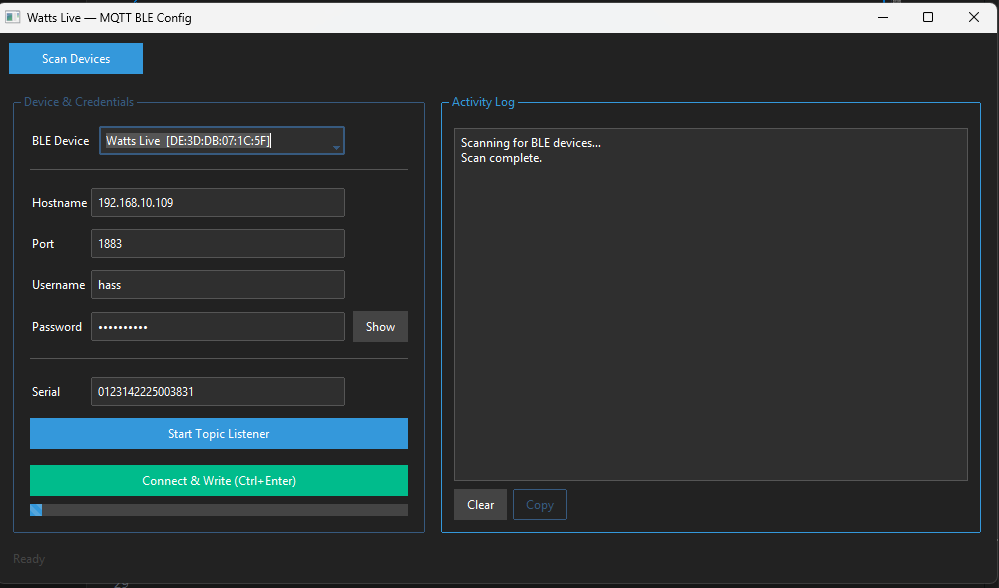
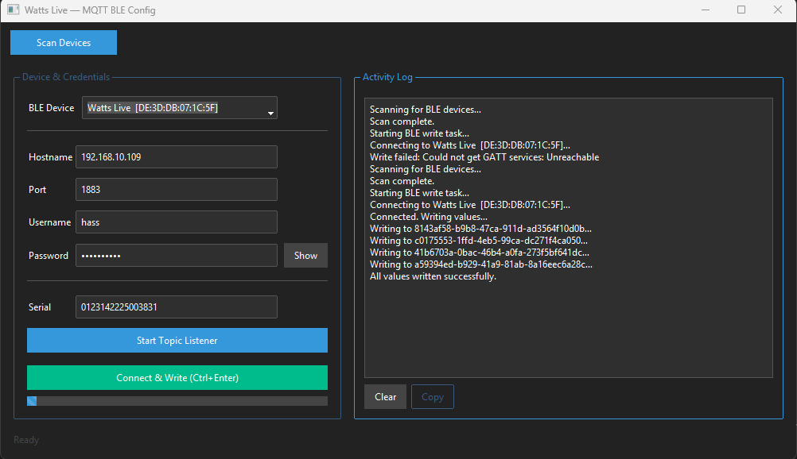
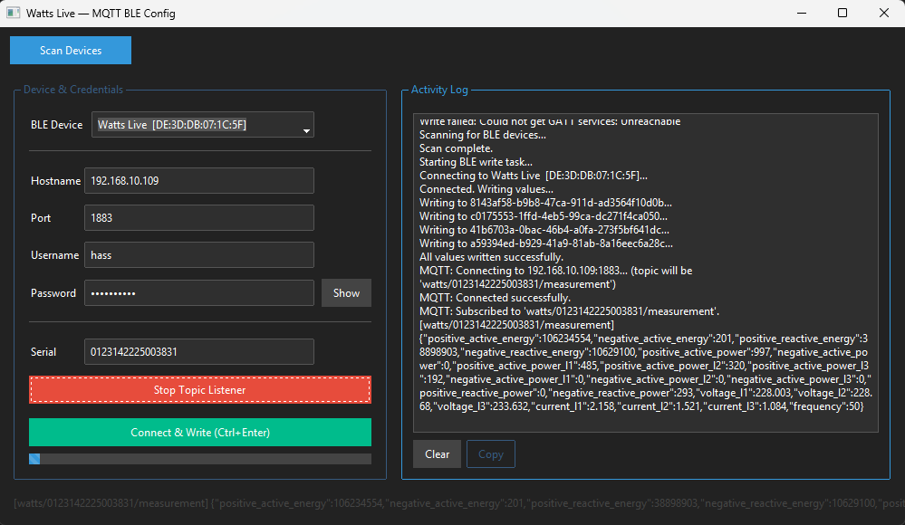

#  Watts Live MQTT BLE Config

[![GitHub Release][releases-shield]][releases]
[![GitHub Activity][commits-shield]][commits]
[![License][license-shield]](LICENSE)
[![hacs][hacsbadge]][hacs]
![Project Maintenance][maintenance-shield]

<a href="https://buymeacoffee.com/mitsmarthome" target="_blank"></a>

A cross-platform desktop tool to configure **Watts Live** IoT devices over **Bluetooth Low Energy (BLE)** and monitor **MQTT messages** in real time.

This app allows you to scan for BLE-enabled Watts Live devices, enter MQTT connection credentials, write them to the device, and optionally connect to your MQTT broker to view live measurement messages.

---

##  Features

-  Scan for nearby **BLE devices** (e.g., “Watts Live”)
-  Connect and write **MQTT configuration** to the device:
  - Hostname  
  - Port  
  - Username  
  - Password
-  Subscribe to an MQTT topic automatically:
  - Uses a **Serial Number** entered by the user  
  - Topic format: `watts/<serial_number>/measurement`
-  Built-in **Activity Log** to display:
  - BLE connection status  
  - Write progress  
  - Live MQTT messages
-  **Modern, dark-themed GUI** built with [ttkbootstrap](https://github.com/israel-dryer/ttkbootstrap)
-  Input validation with real-time feedback and friendly error highlights
-  Cross-platform (Windows, macOS, Linux)

---

## Desktop GUI Version

### Requirements

- Python **3.8+**
- BLE-compatible adapter (Bluetooth 4.0+)
- MQTT broker (for listener feature)
- OS: Windows, macOS, or Linux

---

###  Installation & Usage

```bash
# Clone the repository
git clone https://github.com/DonSidro/watts-live-mqtt-ble-config.git
cd watts-live-mqtt-ble-config

# Install dependencies
pip install -r requirements.txt

# Run the GUI app
python watts_live_gui.py
```

---

##  requirements.txt

```
bleak>=0.22.0
paho-mqtt>=1.6.1
ttkbootstrap>=1.10.1
```

---

##  Building a Standalone App

Prebuilt binaries for **Windows** and **macOS (Apple Silicon)** are attached to every
[release][releases] — GitHub Actions builds them automatically on each `v*` tag. Build
locally only if you want to change something.

> [!NOTE]
> [PyInstaller](https://pyinstaller.org/) cannot cross-compile. A Windows `.exe` has to be
> built on Windows, and a macOS `.app` has to be built on macOS.

### Windows

```bash
pip install pyinstaller
pyinstaller --noconfirm --onefile --windowed watts_live_gui.py
```

Optionally include an app icon:

```bash
pyinstaller --onefile --windowed --icon=watts_live.ico watts_live_gui.py
```

### macOS

Build with the checked-in [`watts_live_gui.spec`](watts_live_gui.spec). A plain
`--onefile --windowed` build will **not** work: since macOS 11, the system terminates any
app that touches CoreBluetooth without an `NSBluetoothAlwaysUsageDescription` key in its
`Info.plist`, so device scanning fails with no useful error. The spec adds that key.

```bash
brew install python-tk       # the system Tcl/Tk 8.5 is too old for ttkbootstrap
pip install "pyinstaller>=6.0" -r requirements.txt
pyinstaller --noconfirm watts_live_gui.spec
open dist/WattsLiveConfig.app
```

The spec builds a **onedir** bundle on purpose. A onefile app unpacks itself into a fresh
temporary directory on every launch, so macOS sees a different app each time and re-asks
for — or silently denies — Bluetooth permission.

After building, the executable or `.app` appears in the `dist/` folder.

---

##  BLE Permissions & Notes

### Windows
- Ensure **Bluetooth is enabled**
- Run as administrator if BLE access is restricted

### macOS
- On the first scan, macOS asks for Bluetooth access — approve it. The setting can be
  reviewed later under **System Settings → Privacy & Security → Bluetooth**.
- Builds on the releases page are **not notarized by Apple**, so Gatekeeper quarantines them
  and reports *“WattsLiveConfig.app is damaged and can’t be opened.”* This is the quarantine
  flag, not a corrupt download — clear it once, after unzipping:

  ```bash
  xattr -dr com.apple.quarantine WattsLiveConfig.app
  ```

- The published build requires **macOS 11 (Big Sur) or newer on Apple Silicon**. On an Intel
  Mac, build locally with the steps above.

### Linux
- Bluetooth permissions may require approval via system dialog

---

##  Technical BLE Info

### Service UUID
```
a2e1ea9b-01e8-4fe5-9b99-35e9cb44d4b6
```

### Characteristic Map

| Field     | Characteristic UUID                             | Format                |
|------------|--------------------------------------------------|------------------------|
| Hostname  | 8143af58-b9b8-47ca-911d-ad3564f10d0b             | UTF-8 string           |
| Port      | c0175553-1ffd-4eb5-99ca-dc271f4ca050             | uint16 (Little Endian) |
| Username  | 41b6703a-0bac-46b4-a0fa-273f5bf641dc             | UTF-8 string           |
| Password  | a59394ed-b929-41a9-81ab-8a16eec6a28c             | UTF-8 string           |

---

##  MQTT Listener Example

| Field | Example |
|-------|----------|
| **Hostname** | `mqtt.myserver.com` |
| **Port** | `1883` |
| **Username** | `admin` |
| **Password** | `secret` |
| **Serial number** | `ABC1234` |
| **Resulting topic** | `watts/ABC1234/measurement` |

Messages from this topic appear live in the **Activity Log** panel.

---

## Screenshots

### Main App


### Activity Log


### Activity Log with MQTT Messages


---

## Project Structure

```
watts-live-mqtt-ble-config/
├── watts_live_gui.py      # Python GUI app
├── watts_live_gui.spec    # PyInstaller spec for the macOS .app bundle
├── .github/workflows/     # CI: builds the Windows .exe and macOS .app on each tag
├── README.md              # This file
├── requirements.txt       # Python dependencies
├── images/                # Screenshots
└── LICENSE
```

---

# Q&A

This page answers common questions about **watts-live-mqtt-ble-config**.

#### **Q: What is this project?**
#### **A:**  A simple python tool that lets you change the Characteristic UUID values of the Watts Live module enabling MQTT
--
#### **Q: Why was this project created?**
#### **A:**  To take away the need of using an mobile app for manually changing the Characteristic UUID values and simplyfy the process.
--
#### **Q: Who is this project for?**
#### **A:**  The user that wants to integrated the Watts Live module into Home Assistant or other Smart Home systems.
--
#### **Q: Where do I get user/password from?**
#### **A:**  If you are using HAOS and Mosquitto add-on the user/password will be the as your HA user/password (it's recomended to create an MQTT user).
If you are using HA Container user/password are set in the config file inside the Mosquitto container (password.txt).
---

## Development & Contribution

If you’d like to improve the app:

```bash
# Install dependencies
pip install -r requirements.txt

# Run in development mode
python watts_live_gui.py
```

Pull requests and feature improvements are always welcome! 

---

##  License

This project is licensed under the [MIT License](LICENSE).

---

##  Author & Credits

Created by **[Sidon (DonSidro)]**  
Powered by [Bleak](https://github.com/hbldh/bleak), [ttkbootstrap](https://github.com/israel-dryer/ttkbootstrap), and [Paho-MQTT](https://www.eclipse.org/paho/).


[commits-shield]: https://img.shields.io/github/commit-activity/y/DonSidro/watts-live-mqtt-ble-config.svg?style=flat-square
[commits]: https://github.com/DonSidro/watts-live-mqtt-ble-config/commits/main
[hacs]: https://github.com/hacs/integration
[hacsbadge]: https://img.shields.io/badge/HACS-Custom-orange.svg?style=flat-square
[license-shield]: https://img.shields.io/github/license/DonSidro/watts-live-mqtt-ble-config.svg?style=flat-square
[maintenance-shield]: https://img.shields.io/badge/maintainer-%40DonSidro-blue.svg?style=flat-square
[releases-shield]: https://img.shields.io/github/release/DonSidro/watts-live-mqtt-ble-config.svg?include_prereleases&style=flat-square&style=flat-square
[releases]: https://github.com/DonSidro/watts-live-mqtt-ble-config/releases
